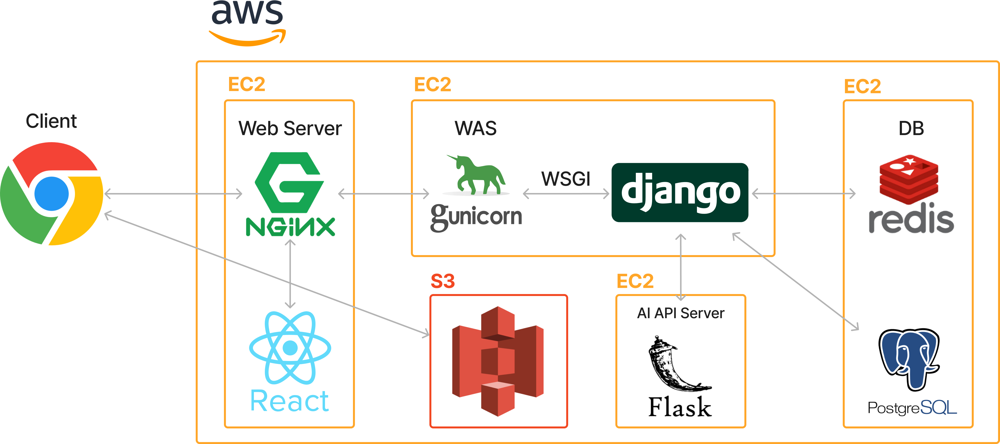

# onion_front

The project Onion provides users with CRUD functionality for managing posts and members, along with features for sorting and reporting posts. Additionally, it offers unique features such as vote-based comment visualization, highlighting popular posts based on user voting data, and embedding-based search for more flexible and rational search results. All these functionalities are implemented using React, React Flow, and Chakra UI.

Key Features
Post and Member CRUD
Create, Read, Update, Delete (CRUD) for Posts
Member Management
Post Sorting and Reporting
Sort posts by Newest, Date, Popularity
Report Inappropriate Posts
Unique Features
Vote-Based Comment Visualization

Visualize the most upvoted comments beneath the parent post, connected by edges
Helps users easily grasp the flow of the discussion
Popular Post Highlights

Aggregate user voting data to highlight popular posts for specific age groups and genders above the title
Embedding-Based Search

Provides more flexible and rational search results
Tech Stack

React: Library for building user interfaces

React Flow: Diagram library for comment visualization

Chakra UI: Library providing beautiful and responsive UI components

onion-pi.com

Ebedding search

SignUp

LogIn

Onion-pi.com/onion_pk

Voting Onion

Onion-pi.com/versus/create

